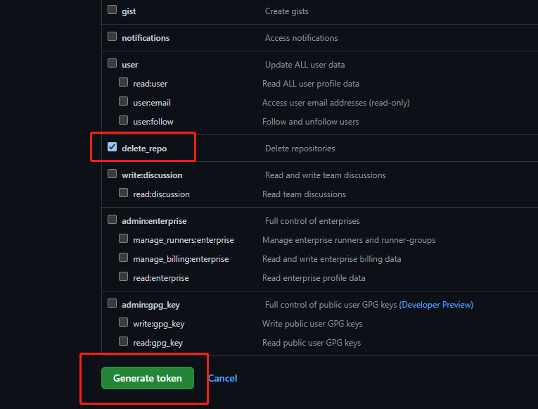
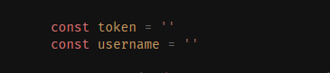

# 批量删除Github中的仓库（JavaScript版本）

## 开始使用

1. 创建token

    头像 -> Settings -> Developer settings -> Personal access tokens -> Generate new token

    [传送门](https://github.com/settings/tokens)

2. 勾选`delete_repo` 保存并复制token



3. ```shell
    git clone https://github.com/antleei/repo-delete-batch
    cd repo-delete-batch
    ```

4. 修改 `index.js` 中的 `token` 和 `username` 

    在 `repo.txt` 中输入要删除的仓库名字，每行一个

    

5. ````shell
    node index.js
    ````